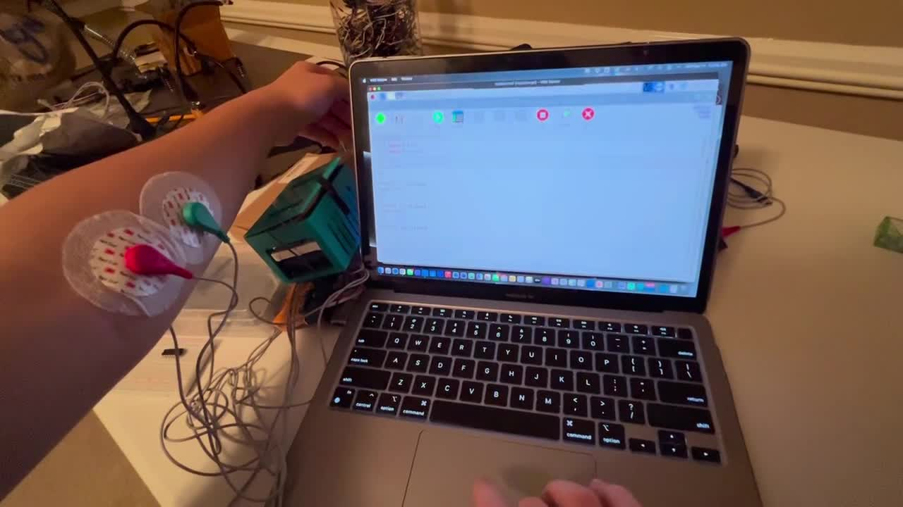
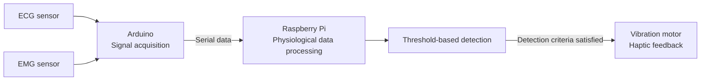

# Physiological Pain Detection & Haptic Feedback System

An Arduino and Raspberry Pi prototype that acquires ECG and EMG signals, applies threshold-based detection logic, and triggers a vibration motor when the detection criteria are met.

**Engineering focus:** sensor acquisition · serial communication · embedded processing · haptic feedback

*Frame at 00:05 from the [muscle-tension demonstration](media/muscle-tension-demo.mp4), showing electrodes on a forearm beside a laptop.*

## Overview

I developed an embedded sensing system that uses ECG and EMG sensors to collect heart-rate and muscle-tension information. An Arduino acquires the sensor signals and sends data over a serial connection to a Raspberry Pi. A threshold-based algorithm on the Raspberry Pi evaluates the physiological data for a potential pain episode and triggers haptic feedback when the detection conditions are satisfied.

This repository documents the prototype architecture, demonstration media, and available result images. Firmware, processing code, wiring details, and a reproducible test procedure are **TODO**. Clinical diagnostic performance has not been established.

## My Contribution

- Integrated ECG and EMG sensors with an Arduino-based acquisition system.
- Established serial communication between the Arduino and Raspberry Pi.
- Processed heart-rate and muscle-tension measurements.
- Developed threshold-based logic to identify potential pain episodes.
- Integrated vibration feedback with the sensing and processing pipeline.

**TODO:** Add project dates, team context, and collaborators' responsibilities if this was a team project.

## System Architecture

This is a functional block diagram. The motor control path and electrical driver circuit are **TODO**; the diagram does not specify a direct Raspberry Pi-to-motor connection.

## Hardware

| Component | Role | Details to add |
| --- | --- | --- |
| ECG sensor | Supplies cardiac activity information | **TODO:** model, interface, electrode arrangement |
| EMG sensor | Supplies muscle activity information | **TODO:** model, interface, electrode arrangement |
| Arduino | Acquires sensor signals and sends serial data | **TODO:** board model, ADC settings, wiring |
| Raspberry Pi | Processes incoming data and evaluates thresholds | **TODO:** model and operating system |
| Vibration motor | Provides feedback after a detection | **TODO:** motor specification, driver, power supply, controlling device |

**TODO:** Add a labeled hardware photo and a wiring diagram or schematic with pin assignments and supply voltages.

## Software / Firmware

| Stage | Documented responsibility | Details to add |
| --- | --- | --- |
| Arduino acquisition | Read sensor signals and transmit them | **TODO:** firmware, sampling rate, channel timing |
| Serial link | Transfer measurements to the Raspberry Pi | **TODO:** baud rate, message format, units, error handling |
| Raspberry Pi processing | Evaluate physiological information with thresholds | **TODO:** source, dependencies, preprocessing, feature calculations |
| Detection and feedback | Activate vibration when criteria are satisfied | **TODO:** threshold values, decision window, feedback duration and reset behavior |

**TODO:** Confirm implementation languages before listing Python or C/C++ as demonstrated project technologies.

## Engineering Decisions

The architecture separates Arduino signal acquisition from Raspberry Pi processing and connects them through a serial data path. The detection approach uses explicit thresholds.

**TODO:** Record the reasons for this partition, the threshold-selection process, and any alternatives evaluated.

## Implementation

The documented processing sequence is acquisition → serial transfer → physiological-data evaluation → threshold decision → vibration feedback.

**TODO:** Add the actual ECG and EMG preprocessing steps, heart-rate calculation, muscle-tension representation, calibration method, and threshold rule. Link to the relevant source files when available.

## Challenges & Debugging

**TODO:** Add a development example with the observed symptom, diagnosis, fix, and verification.

## Testing & Results

The available artifacts include two EMG display screenshots and a confusion matrix. The matrix labels its rows as true labels and its columns as predicted labels:

| True label \ Predicted label | No Pain | Pain |
| --- | ---: | ---: |
| No Pain | 155 | 8 |
| Pain | 30 | 149 |

These are the counts displayed in the supplied image. The evaluation protocol, labeling method, observation unit, and relationship between the matrix and the prototype's threshold settings are **TODO**. The counts alone do not establish performance on new participants or clinical pain detection.

See [result images and interpretation notes](results/README.md) for the original matrix, the second EMG capture, and remaining verification details.

**TODO:** Add test conditions, expected behavior, false-trigger examples, sampling rate, and measured detection latency. Report accuracy or other performance metrics only with the corresponding evaluation method.

## Media

- [EMG display capture 1](images/emg-display-01.png)
- [EMG display capture 2](images/emg-display-02.png)
- [Confusion matrix](results/confusion-matrix.png)
- [Muscle-tension demonstration video](media/muscle-tension-demo.mp4)

The preview shows the muscle-tension demonstration setup at 00:05. **TODO:** Add a walkthrough relating inputs, signal changes, detection, and feedback to timestamps in the video.

## Repository Structure

| Path | Contents |
| --- | --- |
| `images/` | Original signal-display captures and a demonstration preview |
| `results/` | Confusion matrix and interpretation notes |
| `media/` | Demonstration video in a browser-compatible format |

Add `src/` when firmware and processing scripts are available, and `hardware/` when schematics or wiring files are available.

## Reproducing the Prototype

Reproduction instructions are **TODO** until the board and sensor models, source code, wiring, dependencies, thresholds, and acquisition settings are documented. Add setup steps and a verification procedure alongside those files.

## What I Learned

**TODO:** Add specific lessons from implementing the acquisition-to-feedback pipeline, supported by an actual design decision, debugging example, or test result.

## Future Improvements

- Document and version the firmware, processing code, wiring, and acquisition settings.
- Record a repeatable evaluation procedure with explicit labels and observation units.
- Measure detection latency from an identified input event to motor activation.
- Add synchronized signal and feedback records to make threshold behavior inspectable.
