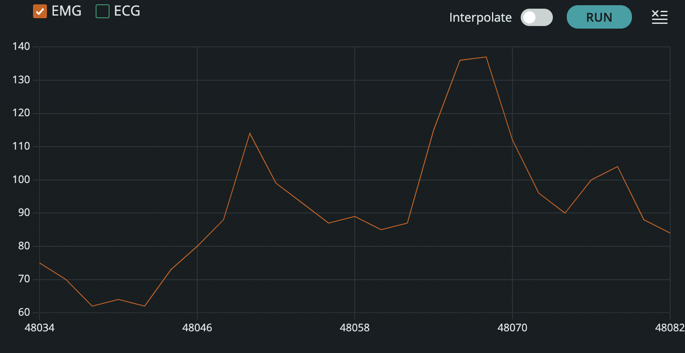
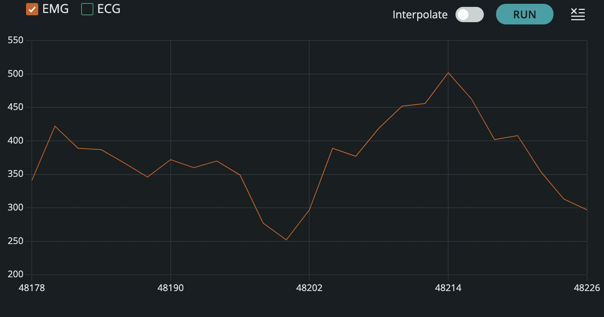
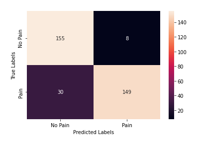

# Physiological Pain Detection & Haptic Feedback System

An Arduino and Raspberry Pi prototype that acquires ECG and EMG signals, applies threshold-based detection logic, and triggers a vibration motor when the detection criteria are met.

**Engineering focus:** sensor acquisition · serial communication · embedded processing · haptic feedback

## Demonstration

https://github.com/user-attachments/assets/4919e1b3-1209-40a2-9ee4-c43f15216313

*Muscle-tension demonstration with electrodes on a forearm beside a laptop.*

## Overview

I developed an embedded sensing system that uses ECG and EMG sensors to collect heart-rate and muscle-tension information. An Arduino acquires the sensor signals and sends data over a serial connection to a Raspberry Pi. A threshold-based algorithm evaluates the physiological data for a potential pain episode and triggers haptic feedback when the detection conditions are satisfied.

## My Contribution

- Integrated ECG and EMG sensors with an Arduino-based acquisition system.
- Established serial communication between the Arduino and Raspberry Pi.
- Processed heart-rate and muscle-tension measurements.
- Developed threshold-based logic to identify potential pain episodes.
- Integrated vibration feedback with the sensing and processing pipeline.

## Hardware & Processing

| Component | Role |
| --- | --- |
| ECG sensor | Supplies cardiac activity information |
| EMG sensor | Supplies muscle activity information |
| Arduino | Acquires sensor signals and transmits measurements |
| Raspberry Pi | Processes measurements and evaluates detection thresholds |
| Vibration motor | Provides feedback after a detection |

## Verification & Results

### EMG Signal Captures

Both captures show the EMG channel selected. They provide a visual record of the displayed signals; axis units and capture conditions are not documented in the images.

### Confusion Matrix

| True label \ Predicted label | No Pain | Pain |
| --- | ---: | ---: |
| No Pain | 155 | 8 |
| Pain | 30 | 149 |

The table transcribes the supplied matrix. Its evaluation protocol and labeling method are not documented, so these counts do not establish performance on new participants or clinical diagnostic validity.

See [result notes and media provenance](results/README.md) for additional context.

## Repository Contents

| Path | Contents |
| --- | --- |
| `images/` | Signal-display captures and demonstration preview |
| `results/` | Confusion matrix and interpretation notes |
| `media/` | Muscle-tension demonstration video |
