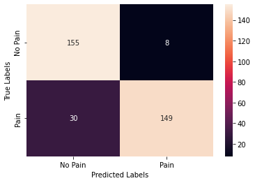

# Results and Signal Captures

This page records the available visual evidence for the prototype. The original media filenames use the project name **Chronisense**.

## Confusion Matrix

The image has a transparent background; the table preserves its labels and values for readability in either theme.

| True label \ Predicted label | No Pain | Pain | Row total |
| --- | ---: | ---: | ---: |
| No Pain | 155 | 8 | 163 |
| Pain | 30 | 149 | 179 |
| Column total | 185 | 157 | 342 |

The displayed cells sum to 342, with 304 entries on the diagonal and 38 off the diagonal. These totals are arithmetic derived from the image. The observation unit, labeling method, evaluation protocol, and separation of development and evaluation data are not documented. Generalization to new participants and clinical performance remain unverified.

## EMG Display Captures

Both screenshots show an orange trace with **EMG** selected and **ECG** unselected. They display different numerical ranges without axis titles or units. The images alone do not establish physical units, timing, filtering, calibration, or muscle-activity conditions.

## Media Provenance

| Repository asset | Supplied original filename |
| --- | --- |
| `confusion-matrix.png` | `Chronisense Confusion Matrix.png` |
| `../images/emg-display-01.png` | `Chronisense muscle tension plot.png` |
| `../images/emg-display-02.png` | `Chronisense muscle tension plot 2.png` |
| `../media/muscle-tension-demo.mp4` | `Chronisense muscle tension demo.MOV` |

The filenames are normalized for repository use. The PNGs preserve the supplied images. The video is transcoded to MP4 for browser playback, with embedded metadata removed.
